# 神经网络与深度学习实验报告

- **课程名称**: 神经网络与深度学习
- **专业班级**: 智能科学与技术22-1班
- **学号**: 2206040107
- **日期**: 2024年10月28日

---

## 目录
1. [实验一：基于BP神经网络的应用——MNIST手写数字图片识别](#实验一)
2. [实验二：基于SOM神经网络的应用——IMDB影评的文本聚类处理](#实验二)
3. [实验三：基于深度卷积网络的经典模型如U-net/yolo等的改进及应用——复现《基于YOLOv8 的图像密集目标检测方法》D-Yolov8m](#实验三)
4. [源码及技术文档下载](#源码及技术文档下载)

---

### 实验一：基于BP神经网络的应用——MNIST手写数字图片识别

#### 一、实验目的
本实验旨在构建并训练一个基于BP（Back Propagation，反向传播）神经网络的应用，以实现对手写数字图片的识别。实验选择了经典的MNIST数据集，该数据集包含了60000张28×28像素的手写数字的灰度图像，包含50000张训练图片和10000张测试图片，其广泛用于图像分类和识别任务。

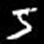

我们希望通过本实验通过理解包括输入层、隐藏层、输出层及各层间的权重和偏置的初始化等BP神经网络的基本结构；掌握前向传播和反向传播过程，从而掌握如何通过前向传播得到网络的输出值，并通过反向传播更新网络权重，以最小化预测误差。最终实现MNIST数据集的分类任务，使得训练网络使其能够识别并分类手写数字，评估网络的准确性。

作为一种典型的有监督学习算法，模型通过一组带标签的数据进行训练，以便在遇到新的数据时能够进行预测的算法，我们希望通过BP网络的实验，在BP神经网络模型搭建和运用的过程中，验证在有监督学习中学习率、隐藏层大小等超参数对模型性能的影响，通过调整超参数，观察模型在收敛速度和准确率方面的变化。从而积累BP神经网络在图像识别应用中的经验，以及有监督学习的实战应用经验。

#### 二、实验分析
BP神经网络

感知器是BP神经网络中的单个节点，其由输入项、权重、偏置、激活函数、输出组成。

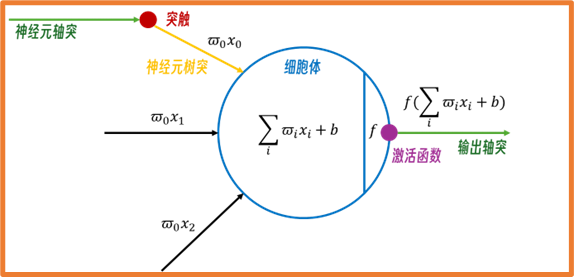

BP神经网络是一种典型的非线性算法，由输入层、隐含层和输出层构成，其中隐含层有一层或者多层。每一层可以有若干个节点。层与层之间节点的连接状态通过权重来体现。

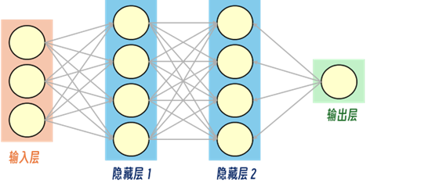

通过多次迭代，不断地对网络上的各个节点间的权重进行调整（更新），权重的调整（更新）采用梯度下降法。一般激活函数采用Sigmoid函数，其表达式和导数如下：

$$\delta\left(x\right)=\frac{1}{1+e^{-x}}$$
$$\frac{d\delta(x)}{dx}=[1-\delta(x)]∙δ(x)$$

#### 三、实验器材
支持Cuda架构的电脑一台，Pycharm软件。

#### 四、实验步骤及内容
我们BP神经网络的MNIST手写数字识别实验的整体流程可以为数据预处理、模型训练和测试验证三个部分。

首先，我们进行数据预处理，我们将训练和测试图片调整为统一的灰度格式和尺寸，归一化处理后进行二值化，提取出图像的特征表示，便于神经网络识别。训练时，标签采用one-hot编码方式，这样网络在训练中可以清楚地识别每个类别。

模型训练环节我们定义了一个包含输入层、隐藏层和输出层的BP神经网络模型。通过前向传播获得网络输出，计算与真实标签之间的误差，使用反向传播算法调整权重和偏置，反复训练直至模型收敛。训练完成后，我们保存了模型的参数，便于后续加载使用。

最后我们将测试集输入训练好的模型，获取预测结果，与真实标签对比后计算准确率，以评估模型的识别效果。

#### 五、实验结果
所训练BP网络模型能满足对手写图片的识别工作。
我们发现过大的学习率和过小的学习率都会导致sigmoid函数溢出，从而导致学习和预测的不准确。而过多或过少的轮次会导致过拟合和欠拟合现象。最终，我们选定learning_rate = 0.0001、epochs = 3000作为初始参数。

当运行train.py时，会调用bpnet.py中的包括前向传播、后向传播、sigmoid等函数，在每一轮次的训练过程中，会输出本次训练的损失函数，便于分析和调整相关参数。

最终，会生成model_weights.npz的权重文件储存在文件结构中。之后，在test.py进行预测的时候，会直接读取该文件的权重，以便无需每一次重新训练，通过读取图像并采取PIL库对图像进行预处理(这里也可采取opencv处理)，之后加载模型进行预测，最终得出每张测试集的结果和总体准确率。准确率可达93%以上。

---

### 实验二：基于SOM神经网络的应用——IMDB影评的文本聚类处理

#### 一、实验目的
本实验旨在构建并训练一个基于SOM（Self-Organizing Map，自组织映射）神经网络的应用，以实现对IMDB影评文本的聚类处理。实验选择了IMDB影评数据集，其中包含大量正面和负面的影评文本样本，用于自然语言处理任务中的文本聚类和情感分析。

我们希望通过本实验理解SOM神经网络的基本结构，包括网络的拓扑结构、竞争层神经元的自组织过程和邻域函数的作用；掌握SOM的训练过程，包括初始化神经元权重、自适应学习率和邻域半径的更新，以便通过无监督学习方法实现文本聚类的效果。最终在IMDB影评数据集上完成文本聚类任务，使SOM网络能够自动归纳影评的情感倾向，并在视觉上展示聚类结果。
作为一种典型的无监督学习算法，SOM网络通过不带标签的数据进行训练，以便对数据进行自适应地分类和聚类。我们希望通过SOM网络的实验，在SOM神经网络模型搭建和运用的过程中，验证网络参数（如学习率、邻域半径和网络拓扑结构）对聚类效果的影响。通过调整这些超参数，观察模型在聚类准确性和收敛速度方面的变化，从而积累SOM神经网络在文本聚类应用中的经验，以及无监督学习的实战应用经验。

#### 二、实验分析
SOM神经网络

SOM(自组织映射神经网络)，通过学习输入空间中的数据，生成一个低维、离散的映射(Map)，与降维算法有相似之处。
SOM是一种无监督的人工神经网络，其运用竞争学习(competitive learning)策略,依靠神经元之间互相竞争逐步优化网络。且使用近邻关系函数(neighborhood function)来维持输入空间的拓扑结构。
SOM的网络结构有2层：输入层、输出层(也叫竞争层)。

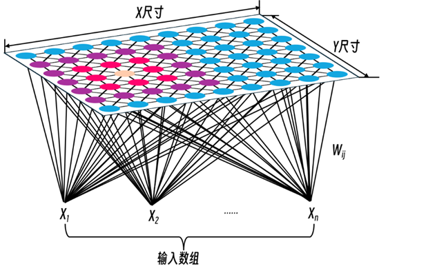

输入层神经元的数量是由输入向量的维度决定的，一个神经元对应一个特征；而竞争层存在不同的维度，常见的是一维和二维。二维平面有2种平面结构，分为Rectangular（矩形）和Hexagonal（六边形）。

在训练的过程中，优胜节点更新后会更靠近输入样本Xi在空间中的位置。优胜节点拓扑上的邻近节点也类似地被更新，即SOM网络的竞争调节策略。

SOM和聚类分析

聚类分析是一种探索性分析方法，聚类分析会根据样本数据的特征，自动进行分类。聚类分析以相似性为基础，在一个聚类中的模式之间比不在同一聚类中的模式之间具有更多的相似性。

自组织映射(Self-Organizing Map, SOM)是一种基于神经网络的聚类算法，也被称为Kohonen网络。它通过在输入数据空间中构建一个低维网格，并通过训练来调整网格上的权重向量，从而将输入数据样本聚类到不同的网格单元中。

与其他基于神经网络的聚类算法相比，SOM具有拓扑结构保持能力、自适应性、高维数据处理能力等特点，与其他神经网络相比，具有计算效率高、鲁棒性好、可视化能力强；但是，也存在参数选择依赖经验、对初始权重向量的依赖的缺点和不足。

#### 三、实验器材
与实验一相同。

#### 四、实验步骤及内容
在我们SOM神经网络的IMDB影评文本聚类实验中，整体流程依旧可以概括为数据预处理、模型训练和聚类验证三个部分。

在数据预处理部分，我们将影评文本数据转化为适合SOM输入的数值向量。通过文本分词、TF-IDF计算等预训练词向量表示方法，我们将影评文本统一为固定长度的特征向量。这样可以更好地捕捉文本的语义信息，并为SOM网络的聚类操作提供更清晰的输入。

之后在SOM神经网络中主要依靠SOM网络函数进行自组织映射和权重更新。通过对竞争层的每个神经元自适应调整权重向量，SOM网络将相似的文本聚集到相邻神经元上。训练过程中，我们控制学习率的动态调整和邻域半径的缩小，以优化训练效果，使得网络逐渐收敛到稳定的权重配置。

最后通过SOM函数获取文本的最佳匹配神经元（BMU），以评估文本之间的相似性分布。使得我们可以根据聚类结果分析不同影评类别的主题分布情况，从而验证SOM在文本聚类任务中的表现，并进一步进行影评的自动化分类和主题分析。

#### 五、实验结果
当result.py运行时，首先进行数据预处理和提取特征，提取各个文本的文本特征，随后对SOM神经网络进行训练，其中会调用som.py的相关函数，训练完成后，将每个数据点映射到 SOM 上的 BMU 节点，并降重至二维，提取BMU二维坐标，最后绘制带标签的 BMU 位置的 PCA 投影和具有密度的 BMU 位置的 PCA 投影两幅图像。

当训练次数很少的时候数据分布未开始聚类，主要分散到各个点中，其位置和密度投影如下图所示：

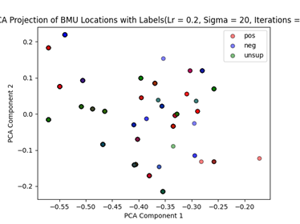
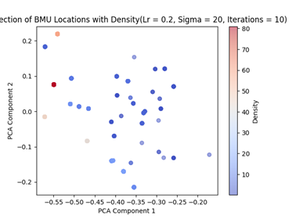

而随着训练次数的增加，数据逐渐呈现聚类分布，当次数达到2000轮次的时候，呈现比较明显的聚类

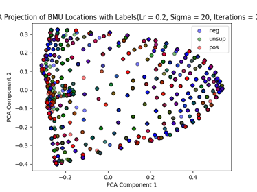
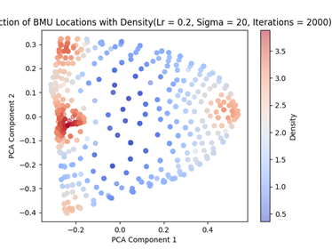

接下来探讨不同参数对聚类分布的影响。我们将学习率=0.2、邻域半径=20、训练次数=10的实验结果作为对照组，依次修改学习率、邻域半径Sigma、训练次数的值。首先是训练次数，当训练轮次继续增加，达到20000轮次的时候，其图像分布如下：

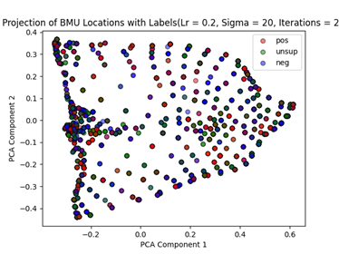
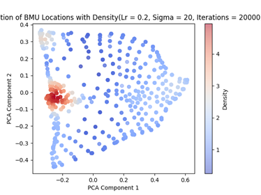

在对照组的条件下修改学习率，当学习率下调至0.1时，其分布和密度图像如下：

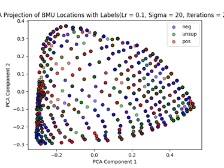
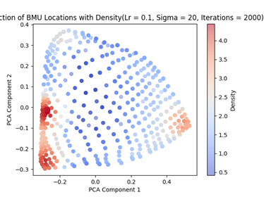

最后对照组的条件下修改邻域半径Sigma, 邻域半径Sigma的值不应超过SOM网格的行数/列数，这里我们下调邻域半径至10，分布和密度函数如下：

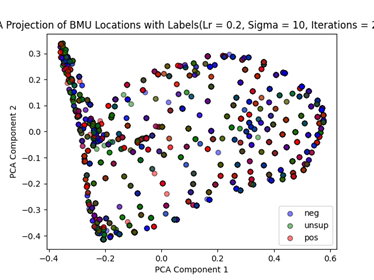
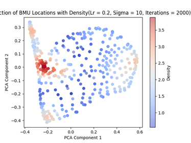

---

### 实验三：基于深度卷积网络的经典模型如U-net/yolo等的改进及应用——复现《基于YOLOv8 的图像密集目标检测方法》D-Yolov8m

#### 一、实验目的
本实验旨在对YOLO模型进行改进，以提升在密集目标检测中的表现。这里选取了YOLOv8模型，实验参考了论文[《Dense object detection methods in RAW UAV imagery based on YOLOv8》](https://www.nature.com/articles/s41598-024-69106-y)的方法并依据其方法进行结果复现。

#### 二、实验分析
YOLOv8 是一种通用的目标检测方法，在大型场景中取得了良好的效果，但在密集目标检测方面表现不佳。因此本模型改进主要针对于密集目标检测。

D-YOLOv8模型采用轻量级骨干网络提取多级特征，以满足密集物体检测的需求。为了进一步提高检测效率和准确性，该模型引入了D-FPN模块，该模块提取浅层特征并整合多级位置信息。此外，D-YOLOv8引入了一个密集注意力层，该层更有效地将注意力权重应用于密集区域，进一步提高了密集物体检测的效率。

在D-YOLOv8 中，为了进一步提高检测精度，采用具有适当权重的CIoU 和 DFL的组合来形成边界框损失，同时使用BCE 构建类别损失，其损失函数如下：

$$Loss=\tau L_{CIoU}+\mu L_{DF}+\omega L_{BC}$$

其中：

$$\begin{matrix}IoU&=\frac{P_b\cap Y_b}{P_b+Y_b-P_b\cap Y_b}\\L_{CIoU}&=1-IoU+\frac{c^2}{d^2}+v\cdot\lambda\cdot\frac{d^2}{(c^2+\epsilon)}\\\end{matrix}$$

BCE（二元交叉熵）用于计算分类损失：

$$L_{BCE}=-\left[Y_clog{(P_c})+\left(1-Y_c\right)log{(1-P_c)}\right]$$

分布式焦点损失（DFL）是一种新颖的定位损失函数，用于构建无锚点检测头，解决正负样本中的类别不平衡问题，同时提高模型准确率。

$$\begin{matrix}L(w_L,P_i,Y_i)=\sum_{k=1}^{w_L}CE(P_{i,k},Y_{i,k})\\R(w_R,P_i,Y_i)=\sum_{k=1}^{w_R}CE(P_{i,k},Y_{i,k})\\L_{DFL}=\frac{1}{N}\sum_{i=1}^{N}(\gamma L(w_L,P_i,Y_i)+\delta R(w_R,P_i,Y_i))\\\end{matrix}$$

其模型架构与原始Yolov8对比如下：

#### 三、实验器材
与实验一相同。

#### 四、实验步骤及内容
由于论文中所用的数据集是其内部的杏花的数据集，获取较为困难，这里采用iSAID遥感数据集来作为密集物体检测的数据集，iSAID数据集主要体现在对每个图像中的每个对象都进行了像素级别的标注，其包含 15 个类别，是为了解决中目标检测和分割任务中的复杂性而设计的。我们认为作为密集物体检测的目标，其数据集可以完成相关要求，在原论文中，亦将本数据集的内容作为额外的测试来体现模型改进后的进步。

由于数据集规模较为庞大，包含1500余张高精度图片，训练和运行所耗费时间较长，且硬件性能不足，故对原数据集进行删减，最终保留245张训练图片和63张验证图片。首先我们对原本数据集标注格式进行转换，以便适应Yolo模型的数据标注格式，具体见源代码中的trans.py。

我们计划首先在原有的YOLOv8模型引入密集特征金字塔网络（D-FPN）和密集注意力层（DAL），从而增强模型从浅层网络层中提取密集特征的能力，提高对密集小目标的检测性能并且可以让模型更专注于密集区域，抑制背景区域的无关信息。

我们在YOLOv8的主干网络（backbone）中加入D-FPN模块，通过下采样、上采样和卷积操作捕捉密集区域的浅层特征。在网络中加入注意力机制，特别是DAL（Dense Attention Layer），从通道和空间维度聚焦于密集区域的特征。最后形成了新的模型文件cch_yolo.yaml存入到ultralytics文件于其他模型并列的/cfg/models/custom，其中涉及到的DAL和D-FPN层在/models/custom/model.py中定义，并在/models/custom/__init__.py中进行初始化。

在模型训练之前，我们加入模型测试环境test_custom_layers.py，通过简单用例保障模型的可靠性。

#### 五、实验结果
由于数据集精度较高，训练所需时间较长，故暂时采用五次训练作为训练次数，以比较改建前后模型准确性的变化。

两次模型的参数区别如下图所示:

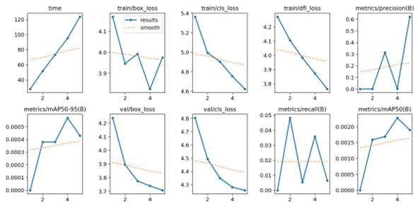

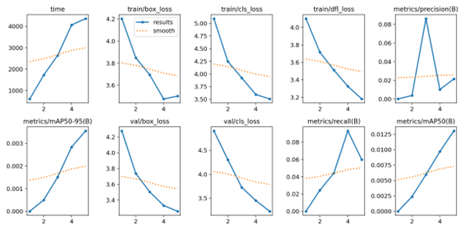

YOLOv8原始模型（上）与添加D-FEN和DAL层改进模型的各项参数对比

可以看出，第一，从模型训练时间上来看，改进模型大大超过原始YOLOv8模型，因为在DFPN模块 包含下采样（卷积）和上采样（反卷积）操作。反卷积尤其计算密集，它会增加参数量和计算量，导致训练时间增加。DAL模块也增加了池化、卷积操作和 Sigmoid 激活层，用于计算通道注意力，两个新增模块的每个操作都需要额外的计算。第二，从验证结果上来看，虽然由于次数偏小，但是两个模型仍有明显的区别，以下图为例：

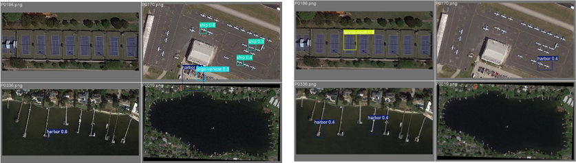

原始YOLOv8模型（左）与调节后模型（右）5次训练条件下表现对比

可以看出，虽然两个模型训练次数较少，都没有完全准确识别出精细遥感图片中的各类物体，但是改良后模型误判的情况明显减少，而在原模型中由于区分度不大而导致将飞机识别为船只等。

而改良后模型在同样训练状况下，其正确识别的物体数量也明显高于原模型，故我们认为改良后模型相较于原YOLOv8模型有一定提高，并且随着训练次数增多会进一步加大模型间差距。

---

### 源码及技术文档下载

可以从 [GitHub仓库](https://github.com/realCCHstudio/DL_homework) 克隆项目，点击此链接以跳转。
